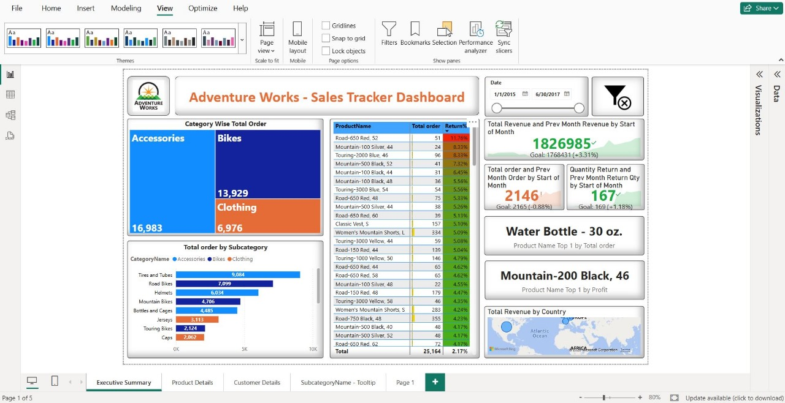
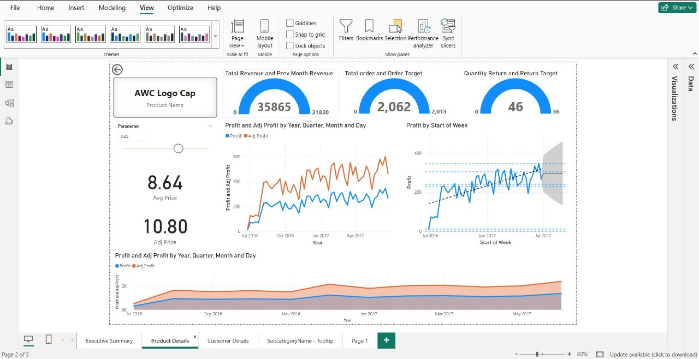
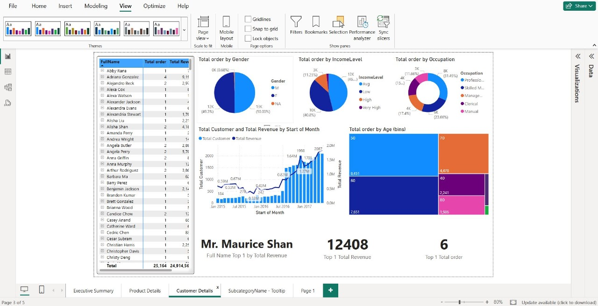
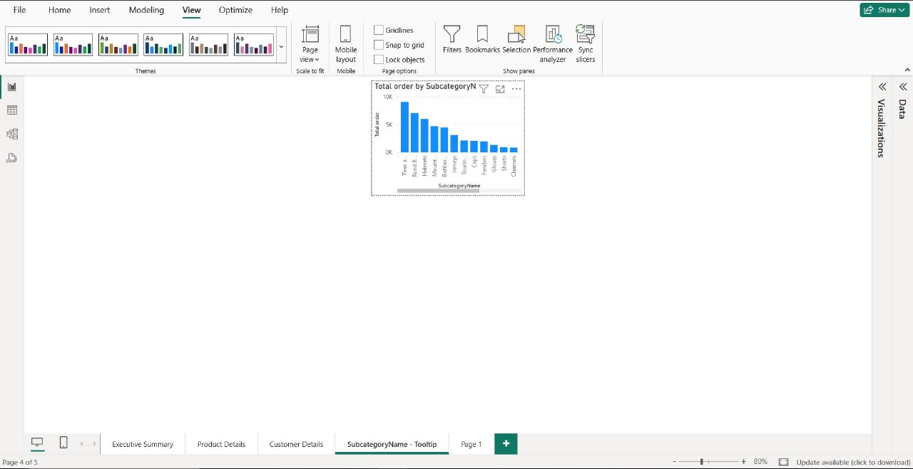

# Adventure Works Sales Report

## Overview
This project analyzes sales data from the Adventure Works dataset to identify trends, top products, and regional performance.

## Tools Used
- Power BI

## Key Insights
- Top-performing product categories
- Monthly and yearly sales trends
- Regional sales comparison

## Files
- `AdventureWorks_Sales_Report.pbix` – Power BI dashboard
- `data/` – Raw dataset

## All Screenshots

